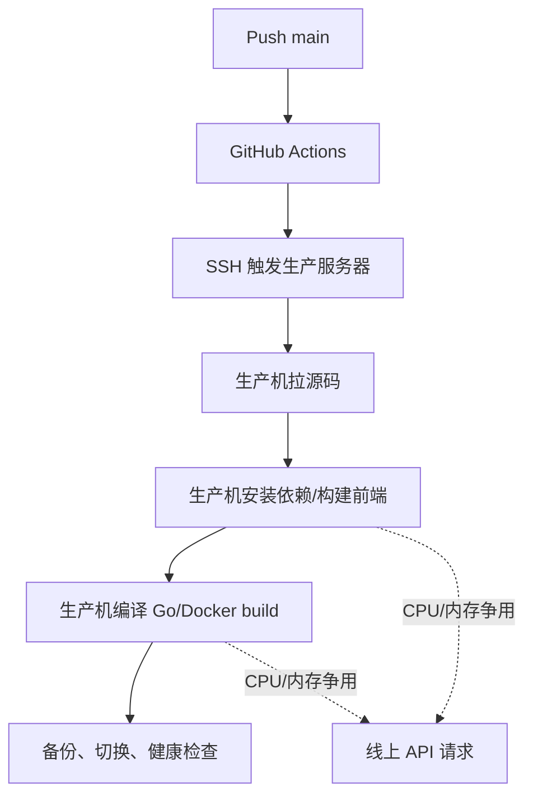
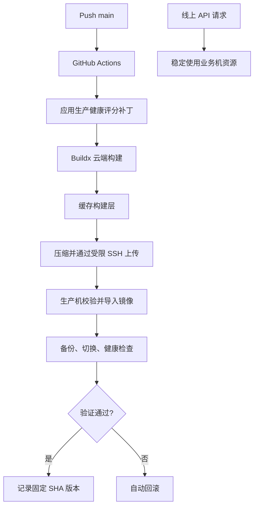

> 历史阶段报告：本文结论仅对应文中记录的采样时间，不代表当前线上状态。

# Sub2API 延迟问题分析与第二阶段优化报告

> 报告时间：2026-09-15 11:54（Asia/Shanghai）  
> 生产版本：`6b89ed613bcd56e46861f01c487bc5cfe994c78a`  
> 数据范围：第一阶段 24 小时基线、优化前后运维看板快照、部署后真实请求与分段日志  
> 结论口径：区分“已证实原因”“相关因素”和“暂不能归因”，不以少量样本承诺固定降幅

---

## 1. 执行摘要

本次问题表现为两类延迟：**首 Token 延迟（TTFT）偏高**，以及**长回复的完整请求耗时长尾明显**。排查后确认，本地鉴权、路由、数据库和 Nginx 不是主要瓶颈；首字等待主要发生在上游响应阶段，完整耗时则主要受推理时间、输出长度和实际生成速度影响。

业务机原先同时承担生产推理转发和 Docker 构建。构建期间 CPU 可达 90%–96%、内存约 88%，会放大部分请求的长尾抖动。因此第二阶段把镜像构建迁移到 GitHub Actions，服务器只执行镜像导入、备份、切换、健康检查和失败回滚。迁移后的云端构建期间，三个业务容器合计 CPU 约 2%，构建资源争用已经消除。

优化后的第一张看板快照显示，请求时长 P95 下降约 41%、P99 下降约 27%。随后滚动一小时窗口纳入数个超长请求，P95/P99 有所回升；与优化前相比，最新快照仍分别低约 20% 和 16%。TTFT 的平均值比优化前低约 13%，最新一次波动中平均值和 P50 反而继续下降。这说明本次“又上来”集中在少量完整请求的长尾，而不是所有请求或首字延迟同步恶化。

总体看板同时受到模型从 Astra/high 转为 Sol、流量构成、上下文和输出长度变化影响，**不能把全部降幅归因于部署构建迁移，也不能把一次滚动窗口回升判断为基础设施回退**。

部署后的分段日志给出了更可靠的根因证据：截至 11:48 的 22 条详细样本中，本地鉴权平均 51 ms、路由平均 6 ms，合计仅 57 ms；首个有效内容平均 5.25 秒，说明约 99% 的首字等待位于上游侧或模型推理阶段。

---

## 2. 问题表现

### 2.1 优化前运维看板

| 指标 | P50 | P90 | P95 | P99 | 平均 | 最大 |
|---|---:|---:|---:|---:|---:|---:|
| 请求时长 | 12.233s | 32.700s | 49.472s | 89.655s | 18.248s | 111.349s |
| TTFT | 3.808s | 6.493s | 8.171s | 10.455s | 4.623s | 11.193s |

主要问题：

- 约 5% 的请求需要接近 50 秒才能完成。
- 约 1% 的请求完整耗时接近 90 秒。
- TTFT P95/P99 分别达到 8.17 秒和 10.46 秒。
- 部署与开发验证期间，业务机 CPU、内存出现明显峰值。

### 2.2 用户感知

```text
发起请求
  ├─ 约 4–10 秒：等待首个有效内容
  └─ 约 10–90 秒：持续生成完整长回复
```

TTFT 决定“多久开始看到回复”；请求时长决定“多久完整结束”。这两个指标需要分别优化。

---

## 3. 根因分析

### 3.1 延迟链路


### 3.2 已证实的主要原因

#### 原因 A：首字等待主要在上游

部署后 22 条结构化分段日志：

| 阶段 | 平均耗时 | 占首内容时间的近似比例 |
|---|---:|---:|
| 本地鉴权 | 51 ms | 1.0% |
| 本地路由/调度 | 6 ms | 0.1% |
| 上游响应头 | 3,036 ms | 57.9% |
| 首个有效内容 | 5,247 ms | 100% |

鉴权与路由合计约 57 ms，仅占首内容等待约 1.1%。因此继续压缩本地查询或增加账号并发，不会带来秒级改善。

#### 原因 B：长回复主要受输出量和生成速度限制

第一阶段最长请求样本的首 Token 后生成速度稳定在约 32.5–33.3 Token/s：

| 完整耗时 | TTFT | 输出 Token | 估算输出速度 |
|---:|---:|---:|---:|
| 111.35s | 4.87s | 3,508 | 32.9 Token/s |
| 80.36s | 3.10s | 2,562 | 33.2 Token/s |
| 73.33s | 3.10s | 2,285 | 32.5 Token/s |

在模型、推理强度和回复长度不降低的前提下，完整耗时不能仅靠中转层大幅缩短。

#### 原因 C：上下文越大，TTFT 越高

第一阶段 24 小时自然流量：

| 输入上下文 | 样本数 | TTFT 平均 | TTFT P95 |
|---|---:|---:|---:|
| <10k | 81 | 1.40s | 3.35s |
| 10k–50k | 366 | 1.75s | 3.54s |
| 50k–100k | 271 | 2.50s | 5.78s |
| ≥100k | 529 | 3.21s | 7.19s |

这是明显相关性，但不是严格控制实验。大上下文本身、请求复杂度和模型选择会共同影响 TTFT。

### 3.3 已证实的放大因素

#### 业务机执行镜像构建

优化前，GitHub Actions 只通过 SSH 触发服务器脚本，前端依赖安装、前端构建、Go 编译和 Docker 镜像构建全部发生在生产服务器。

- 普通空闲 CPU：约 4%–6%。
- 本地验证/构建 CPU：约 90%–96%。
- 构建内存峰值：约 88%。
- 一次 11.19 秒 TTFT 与 CPU 90.6%、内存 86.6% 的构建窗口重合。
- 迁移后云端构建期间，三个业务容器合计 CPU 约 2%。

资源争用不是所有慢请求的原因：另一次约 10.14 秒 TTFT 出现在 CPU 约 5%、输入约 204k 的请求中。这说明构建是长尾放大器，但不是上游基础延迟的来源。

### 3.4 已排除或缺乏证据的原因

| 候选原因 | 检查结果 | 判断 |
|---|---|---|
| 持续排队 | 24 小时分钟采样最大队列深度为 0；部署后详细样本无账号切换、无重试 | 不是当前主要瓶颈 |
| 本地健康接口 | 约 0.7–1.0 ms | 不是瓶颈 |
| 公网入口/Nginx | 服务器自身访问约 30–67 ms，`proxy_buffering off` | 不足以解释秒级 TTFT |
| 代理线路 | 8 个账号均无独立代理，共用服务器直连出口 | 没有“某个代理慢”的证据 |
| 账号 6/7 差异 | 同模型、同上下文区间下 TTFT 接近 | 不支持淘汰账号 |
| 并发不足 | 全部账号并发为 3，未观测到持续排队 | 提高并发预计无明显收益 |

---

## 4. 优化前后架构

### 优化前



### 优化后



---

## 5. 具体优化项

### 5.1 请求侧

1. **机器人独立固定 `gpt-5.6-sol` + `high`**
   - 同时覆盖普通、Default 和 Plan 模式的实际 `turn/start` 参数。
   - 只影响当前 Telegram 机器人实例。
   - 未修改 Sub2API 公共模型映射，其他调用方不受影响。

2. **账号调度参数统一**
   - 8 个 Plus 账号优先级统一为 1。
   - 每个账号并发统一为 3。
   - 该项保证配置一致，但因当前无排队，不能宣称它已降低 TTFT。

3. **保持流式传输**
   - Nginx 响应缓冲关闭。
   - 首个有效内容到达后立即转发。
   - 不以心跳或空 SSE 事件冒充首 Token。

### 5.2 部署侧

1. GitHub Actions 使用 Buildx 构建固定提交镜像。
2. 使用 GitHub Actions cache 复用 pnpm、Go module 和 Go build 层。
3. GitHub runner 使用 `proxy.golang.org` 与 `sum.golang.org`，避免跨区域访问中国镜像。
4. 镜像使用 zstd 压缩后通过既有受限 SSH 密钥上传。
5. 受限密钥只允许以下命令：
   - `status`
   - `upload <40 位 SHA>`
   - `deploy <40 位 SHA>`
6. 上传包最大 1 GiB，先执行 zstd 完整性校验，再原子替换。
7. 服务器导入后校验镜像 revision 标签和程序内嵌完整提交号。
8. 保留数据库备份、应用数据备份、公网健康检查、前端资源检查、管理员登录检查和账户接口检查。
9. 新容器检查失败时自动恢复旧 compose、旧镜像和旧 release 记录。

### 5.3 可观测性

成功请求新增结构化事件 `openai.request_latency`，记录：

- `auth_ms`
- `routing_ms`
- `upstream_headers_ms`
- `first_content_ms`
- `response_after_headers_ms`
- `forward_total_ms`
- `account_switches`
- `same_account_retries`

日志不记录提示词、密钥、Token 内容或响应正文。

---

## 6. 优化前后对比

### 6.1 运维看板快照

| 指标 | 优化前 | 优化后快照 A | 最新快照 B | 优化前 → B |
|---|---:|---:|---:|---:|
| 请求时长平均 | 18.248s | 13.490s | 14.394s | **-21.1%** |
| 请求时长 P50 | 12.233s | 9.491s | 9.926s | **-18.9%** |
| 请求时长 P90 | 32.700s | 24.396s | 25.360s | **-22.4%** |
| 请求时长 P95 | 49.472s | 29.302s | 39.623s | **-19.9%** |
| 请求时长 P99 | 89.655s | 65.283s | 75.743s | **-15.5%** |
| 请求时长最大值 | 111.349s | 127.997s | 127.997s | +15.0% |
| TTFT 平均 | 4.623s | 4.075s | 4.008s | **-13.3%** |
| TTFT P50 | 3.808s | 4.097s | 3.978s | +4.5% |
| TTFT P90 | 6.493s | 6.455s | 6.468s | -0.4% |
| TTFT P95 | 8.171s | 7.487s | 7.826s | **-4.2%** |
| TTFT P99 | 10.455s | 9.645s | 9.933s | **-5.0%** |
| TTFT 最大值 | 11.193s | 11.265s | 11.265s | +0.6% |

**解读：** 快照 A 到 B 期间，请求时长 P95 上升 35.2%、P99 上升 16.0%，但 TTFT 平均下降 1.6%、P50 下降 2.9%，P90 仅上升 0.2%。如果服务器或网络发生整体退化，通常会同时推高 TTFT 中央值；本次数据并不符合这种模式。与优化前相比，快照 B 的请求时长平均、P50–P99 仍全部较低。

### 6.2 为什么指标会“又上来”

管理端“近 1 小时”是滚动窗口。新请求进入、旧请求离开时，百分位会重新计算；在约一百多个样本中，P95/P99 对少量长请求非常敏感。11:54 前的数据库明细显示，窗口内存在以下代表性长请求：

| 时间 | 推理 | TTFT | 完整耗时 | 上下文 Token | 输出 Token | 估算输出速度 |
|---|---|---:|---:|---:|---:|---:|
| 11:50:50 | high | 4.539s | 119.810s | 211,131 | 5,822 | 50.5 Token/s |
| 11:48:37 | high | 9.703s | 77.839s | 207,623 | 2,713 | 39.8 Token/s |
| 11:47:15 | high | 6.273s | 64.080s | 204,217 | 2,414 | 41.8 Token/s |
| 11:52:40 | high | 2.670s | 56.289s | 221,083 | 2,960 | 55.2 Token/s |

这些请求都没有账号切换或同账号重试。119.81 秒请求的 TTFT 只有 4.54 秒，后续生成占约 115 秒，直接说明其完整耗时主要来自大上下文下的长输出。同期生产状态为 healthy，Sub2API CPU 约 1.83%、内存约 81 MiB，PostgreSQL CPU 约 0.36%，Redis CPU 约 0.19%，也没有部署任务运行。

因此，这次回升的判断是：

- **已确认：** 少量大上下文、长输出请求抬高完整耗时 P95/P99。
- **已确认：** TTFT 中央水平没有同步恶化，本地服务没有排队、切换或重试迹象。
- **未发现：** 部署、容器负载或数据库负载导致的整体性能回退。
- **仍需观察：** 固定模型、推理强度和上下文区间下的完整 24 小时数据，才能给出稳定趋势。

### 6.3 同模型/high 的近似同长度窗口

为减少模型混合影响，单独比较 `gpt-5.6-sol / high`：

| 指标 | 部署前约 22 分钟（57 条） | 最终部署后约 20 分钟（22 条） | 变化 |
|---|---:|---:|---:|
| 平均上下文 | 146.9k | 190.6k | +29.8% |
| TTFT 平均 | 4.489s | 5.247s | +16.9% |
| TTFT P50 | 4.220s | 4.730s | +12.1% |
| TTFT P95 | 7.600s | 7.781s | +2.4% |
| 完整耗时平均 | 13.155s | 19.448s | +47.8% |
| 完整耗时 P95 | 29.886s | 63.035s | +110.9% |

这组数据中，部署后的平均上下文增加约 30%，且样本只有 22 条，完整输出长度也未控制。因此它不能用来判断构建迁移让请求变慢；它说明**请求内容和上下文差异足以覆盖基础设施优化带来的小幅变化**。

### 6.4 部署效果

| 项目 | 优化前 | 优化后 |
|---|---|---|
| 镜像构建位置 | 生产服务器 | GitHub Actions runner |
| 构建期间服务器 CPU | 约 90%–96% 峰值 | 三个业务容器合计约 2% |
| 构建期间内存 | 峰值约 88% | 生产容器无构建内存占用 |
| Action 完整耗时 | 最近一次旧流程约 3分34秒 | 首次冷构建 8分39秒；源优化后 5分35秒 |
| 线上风险 | 构建与 API 抢资源 | 构建与 API 隔离 |
| 回滚 | 自动 | 自动，保持不变 |

**取舍：** 自动部署墙钟时间目前没有变短，第二阶段换来的是线上请求不再被构建抢占。后续缓存命中会继续缩短云端构建，但不应把“Action 更快”当作已经实现的结果。

---

## 7. 结果判定

### 已确认有效

- 生产构建已从业务机迁走。
- 构建期间业务容器资源保持低位。
- 生产镜像、提交号、公网健康、前端资源、管理员登录、账户接口全部验证通过。
- 两次优化后快照中，请求时长总体看板的平均值、P50、P90、P95、P99 均低于优化前；滚动窗口内的尾部仍会随长请求波动。
- 已能区分本地处理、上游响应头、首内容、流式输出和重试耗时。
- 当前详细样本未发生账号切换或同账号重试。

### 尚不能确认

- 不能把总体看板降幅全部归功于构建迁移。
- 不能根据 22 条 Sol/high 样本确定稳定的 TTFT 改善比例。
- 不能根据单次一小时快照判断回退或承诺固定降幅。
- 不能通过提高账号并发继续获得明显收益，因为当前没有排队证据。
- 不降低推理强度、不缩短上下文和回复长度时，超长请求的完整耗时仍会存在。

---

## 8. 验证记录

| 验证项 | 结果 |
|---|---|
| 部署脚本单元测试 | 10 项通过 |
| 延迟日志定向测试 | 通过 |
| Go 单元测试 | 通过 |
| Go 集成测试 | 通过 |
| golangci-lint | 通过 |
| 前端类型检查与关键测试 | 通过 |
| Security Scan | 通过 |
| 工作流 YAML/Python 语法 | 通过 |
| 44.7 MB 受限镜像上传演练 | 完整性通过，权限 600 |
| 生产容器 | healthy |
| 公网 `/health` | `status=ok` |
| 运行提交 | `6b89ed613...+local-health` |
| GitHub main 与本地 HEAD | 一致 |

相关提交：

- `288593890` — 迁移生产构建并补充上游延迟观测
- `6b89ed613` — 优化 GitHub Actions 模块下载源

相关 Actions：

- [首次云端构建与生产部署](https://github.com/TContin/Sub2API/actions/runs/34924163162)
- [模块源优化后的生产部署](https://github.com/TContin/Sub2API/actions/runs/34924782303)
- [最终完整 CI](https://github.com/TContin/Sub2API/actions/runs/34924782448)

---

## 9. 如何持续查看效果

在管理端进入 **运维监控**：

1. 时间选择“近 1 小时”。
2. 平台选择 OpenAI。
3. 模型筛选 `gpt-5.6-sol`。
4. 日常关注 TTFT P50/P95 和请求时长 P95。
5. 样本达到 30 条后再初步比较，达到完整 24 小时窗口后再判断稳定趋势。
6. P99 在小样本下波动很大，不单独用它评价账号或线路。

分段诊断使用生产日志中的 `openai.request_latency`。判断顺序：

```text
routing_ms 高             -> 检查并发槽位、调度和本地缓存
upstream_headers_ms 高    -> 检查上游连接、线路和提供方排队
first_content_ms 高       -> 检查模型推理、上下文和请求复杂度
response_after_headers 高 -> 检查输出长度和生成速度
retries/switches > 0      -> 检查账号健康与上游错误
```

---

## 10. 后续建议

1. 保持当前配置运行至少 24 小时，按模型、high 推理和上下文区间重新计算 P50/P95。
2. 将分段耗时聚合进运维看板，减少依赖服务器日志进行诊断。
3. 对 `≥100k` 上下文单独观察；只有在允许改变会话策略时，再评估自动压缩上下文。
4. 保持账号并发 3、优先级 1，不在没有排队证据时继续提高并发。
5. 保持 Sol/high，不通过降低推理质量换取表面延迟下降。

---

## 附录：指标定义

| 指标 | 定义 |
|---|---|
| TTFT / 首 Token | 请求发出到首个实际有效内容，不计空事件和心跳 |
| 请求时长 | 请求开始到完整结束，包括持续输出时间 |
| P50 | 50% 请求不超过该值，中位数 |
| P95 | 95% 请求不超过该值，适合观察日常长尾 |
| P99 | 99% 请求不超过该值，小样本下波动明显 |
| upstream headers | 发出上游请求到收到 HTTP 响应头 |
| response after headers | 收到上游响应头后到完整结束 |

本报告所有对比均基于自然业务流量，不是固定提示词、固定上下文、固定输出长度的压力测试。百分比变化用于描述观察结果，不等同于可重复的因果收益承诺。
